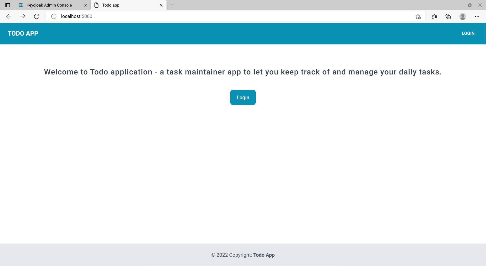
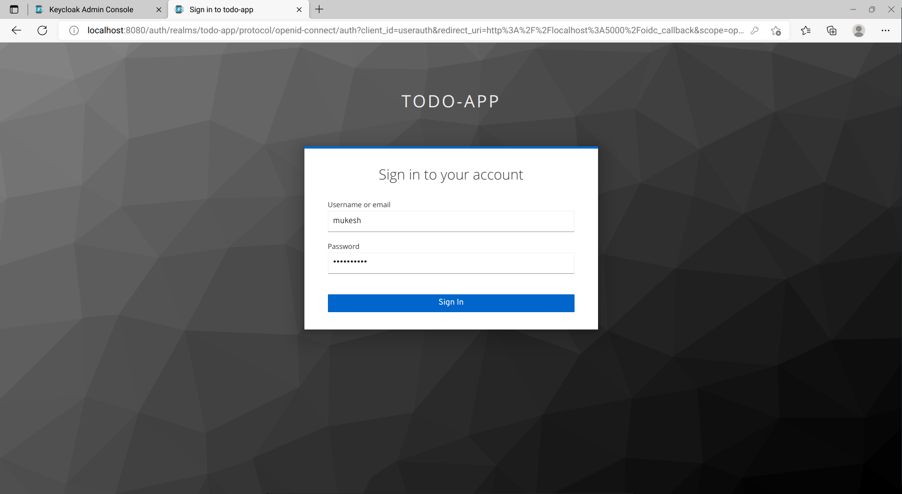
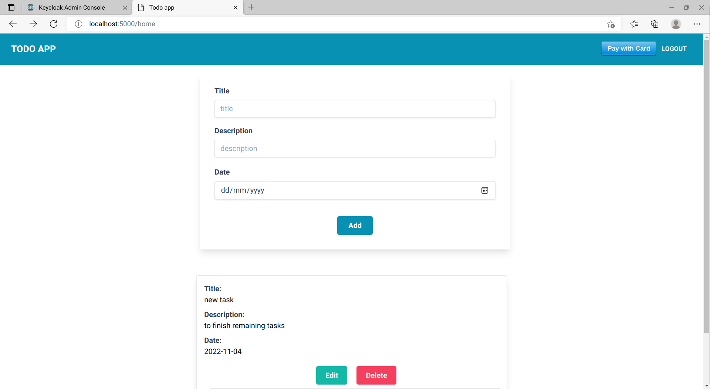
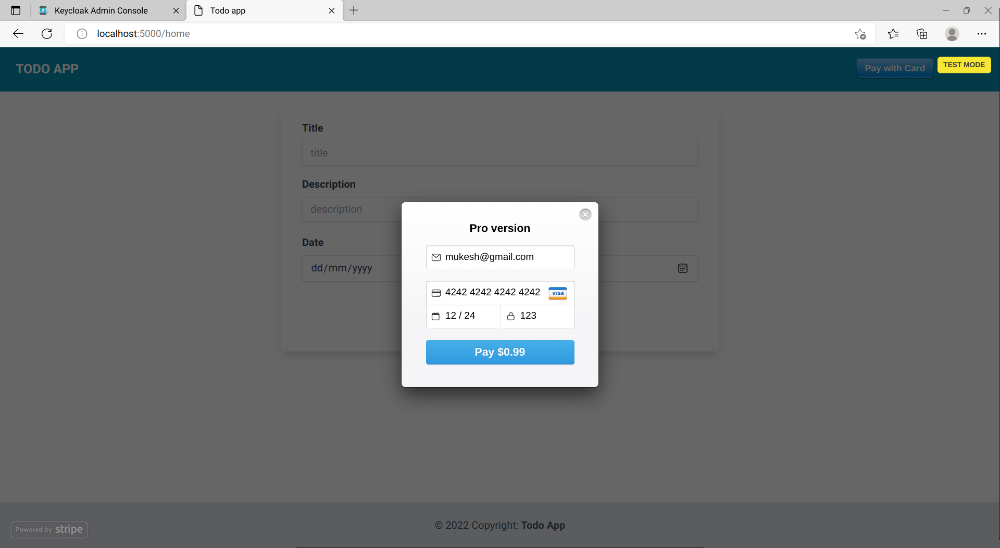
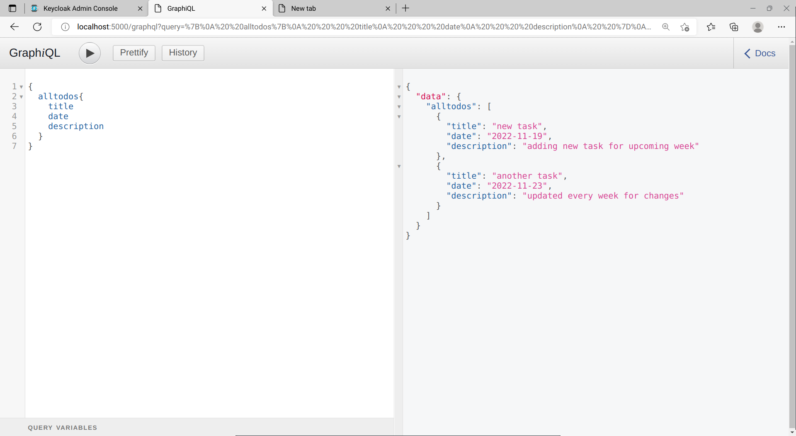

<h1 align="center"> Todo app with flask-graphene-sqlalchemy</h1>

A simple todo application to keep track of the progress of your daily tasks.

## Installation
To install all the required libraries run the following command.

`pip install requirements.txt`

To install tailwind, run the following command

`npm install`

## Demo

1. Landing page

 </img>

2. Authentication with keycloak

 </img>

3. Add tasks

 </img>

4. Pro license purchased with stripe

 </img>

5. GraphQL API calls

 </img>